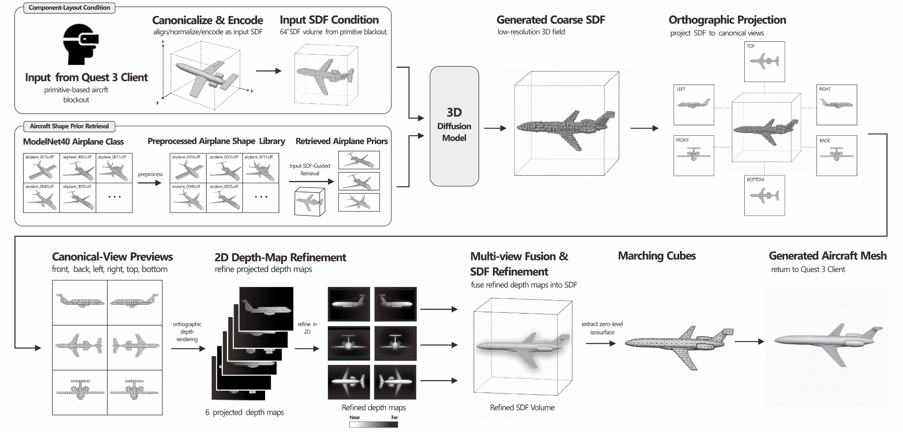

<h1 align="center">AeroForge VR: Design-to-Flight</h1>

<p align="center">
  <strong>2026 IEEE International Symposium on Mixed and Augmented Reality</strong><br>
  Accepted demonstration
</p>

<p align="center">
  <a href="mailto:shang217@umn.edu">Songlin Shang</a> ·
  <a href="mailto:hu000809@umn.edu">Yushen Hu</a><br>
  University of Minnesota – Twin Cities
</p>

<p align="center">
  <a href="https://songlin-git.github.io/AeroForge-VR/"></a>
  <a href="static/pdf/aeroforge-vr-ismar-2026-demo.pdf"></a>
  <a href="https://songlin-git.github.io/AeroForge-VR/#dataset"></a>
</p>

<p align="center">
  <a href="#abstract">Abstract</a> ·
  <a href="#method">Method</a> ·
  <a href="#interactive-data">Interactive data</a> ·
  <a href="#resources">Resources</a> ·
  <a href="#citation">Citation</a>
</p>

## Abstract

AeroForge VR is designed as an entry point to 3D authoring for participants with limited experience using conventional 3D modeling tools. Participants assemble and transform primitives to express an aircraft’s coarse spatial structure and proportions. The system encodes the blockout as a signed distance field (SDF) and retrieves airplane priors. Both condition a 3D diffusion model. After generation, participants navigate their aircraft through a cloudscape and paint mountain terrain. They experience their generated aircraft in motion and explore its spatial form from multiple viewpoints. This design-to-flight workflow integrates spatial authoring, structure-conditioned generation, and in-headset interaction into an immersive creative experience.

## Method

<p align="center">
  <a href="static/images/aeroforge-pipeline.png">
    
  </a>
</p>
<p align="center"><em>Aircraft-generation pipeline. Figure 2 from the paper.</em></p>

**User-authored structure.** Participants assemble boxes, cylinders, and spheres in VR. The blockout is canonicalized and sampled on a **64 × 64 × 64 grid**, producing an input SDF that encodes component layout and proportions.

**Retrieved shape priors.** The same input SDF queries a preprocessed **ModelNet40 airplane** library. The retrieved airplane shapes and the input SDF jointly condition the 3D diffusion model.

**Refinement and return to VR.** The coarse aircraft SDF is rendered from six canonical viewpoints. Refined depth maps are fused into an SDF volume, and Marching Cubes extracts the mesh returned to the Quest 3 application for flight and terrain painting.

## Interactive data

The project page includes a [Shape Prior Explorer](https://songlin-git.github.io/AeroForge-VR/#dataset) and an [Airplane Metadata browser](https://songlin-git.github.io/AeroForge-VR/#metadata). These provide complementary views of the ModelNet40 airplane shapes and their source records.

### Shape Prior Explorer

Inspect **46 selected airplane models** through rotation, zoom, object-ID search, and train/test filtering. Four modes expose the surface geometry and distance-field representation:

| Representation | What to explore |
| :--- | :--- |
| **Surface** | Shaded source shapes using simplified display meshes. |
| **SDF slices** | Linked 3D and 2D cross-sections with adjustable slice position, X/Y/Z plane selection, and sampled distance values. |
| **Zero isosurface** | Surfaces extracted at `d = 0` from the preview distance fields. |
| **Wireframe** | Triangle edges of the display meshes. |

Original OFF statistics are reported separately from display-mesh statistics. Individual distance fields are available as `.npz` files.

**SDF previews.** The fields are 64³ voxel-derived approximations independently computed from ModelNet40 OFF meshes for this viewer. [Preprocessing notes](PREPROCESSING.md) document their construction.

### Airplane Metadata

Browse **726 airplane records** with search, sortable columns, split filters, pagination, and filtered CSV export. Entries marked **3D** open the corresponding shape in the explorer.

| Collection | Train | Test | Total |
| :--- | ---: | ---: | ---: |
| Full airplane metadata | 626 | 100 | **726** |
| Interactive model subset | 15 | 31 | **46** |

Metadata retains the four source fields: `object_id`, `class`, `split`, and `object_path`. Train/test labels follow the original ModelNet40 metadata.

## Resources

This repository contains the project page and its visualization assets. The following files support inspection of the source shapes, metadata, and preview fields.

| Resource | Contents |
| :--- | :--- |
| [Paper](static/pdf/aeroforge-vr-ismar-2026-demo.pdf) | AeroForge VR manuscript. |
| [Airplane metadata](static/data/metadata_modelnet40_airplane.csv) | All 726 airplane records in CSV format. |
| [Preview-subset metadata](static/data/metadata_airplane_preview_subset.csv) | The 46 records corresponding to the interactive models. |
| [Source OFF subset](static/data/modelnet40-airplane-subset.zip) | 46 source meshes with original split folders and matching metadata. |
| [Distance fields](static/fields/) | Per-model `.npz` preview fields and grid information. |
| [Preprocessing](PREPROCESSING.md) | Coordinate conventions, field construction, and display-mesh preparation. |
| [Provenance](static/data/field-provenance.json) | Source checksums, geometry statistics, and field diagnostics. |

**Dataset attribution.** ModelNet40 is provided by the [Princeton ModelNet project](https://modelnet.cs.princeton.edu/). Z. Wu, S. Song, A. Khosla, F. Yu, L. Zhang, X. Tang, and J. Xiao. *3D ShapeNets: A Deep Representation for Volumetric Shapes.* CVPR 2015.

## Citation

To cite the accompanying manuscript, use the following entry or the included [BibTeX file](static/data/aeroforge.bib).

```bibtex
@misc{shang2026aeroforge,
  title  = {AeroForge VR: Design-to-Flight},
  author = {Shang, Songlin and Hu, Yushen},
  year   = {2026},
  note   = {Author-provided manuscript, IEEE ISMAR 2026}
}
```
